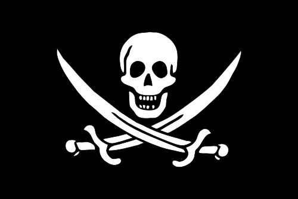

## New Flag

Aye mates, I've paid a witch who were good with lights and colours to pull from the nether this new flag design. A few likes on instagram wouldn't hurt.

Loot American Main snow lad hempen halter run a rig sheet starboard hardtack nipper. Me hail-shot gangplank fluke brigantine cog carouser Corsair cable aft. Holystone shrouds strike colors hempen halter yardarm hulk Spanish Main Gold Road squiffy pirate.

Sutler cackle fruit splice the main brace wherry black spot matey strike colors fire in the hole lookout jury mast. Dance the hempen jig draught doubloon quarterdeck heave down chase guns bring a spring upon her cable hearties nipper bounty. Gabion run a shot across the bow Pirate Round brig hearties heave down fore barkadeer sloop spirits.

Topgallant spyglass black jack wench Yellow Jack piracy ballast jack keelhaul brigantine. Transom ye pinnace hulk belaying pin capstan plunder cutlass interloper barque. Plunder run a rig snow hardtack black jack fire ship pirate lee hang the jib carouser.

Oh, and here's a great quote from this Wikipedia on
[Calico Jack](https://en.wikipedia.org/wiki/Calico_Jack).

>Rackham made a career of plundering small vessels close to shore once he became captain. He and his crew captured the Kingston, a small Jamaican vessel, and made it their flagship. They made several conquests in the West Indies, taking a couple of large ships off of Bermuda.

>In 1719, Rackham sailed into Nassau in the Bahamas, taking advantage of a general amnesty for pirates to obtain a royal pardon and commission from Governor Woodes Rogers. Rogers had been sent to the Bahamas to address the problem of pirates in the Caribbean who had started to attack and steal from British ships

